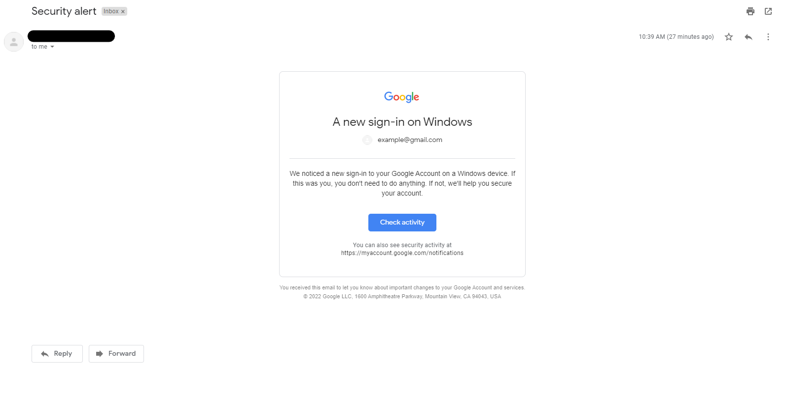
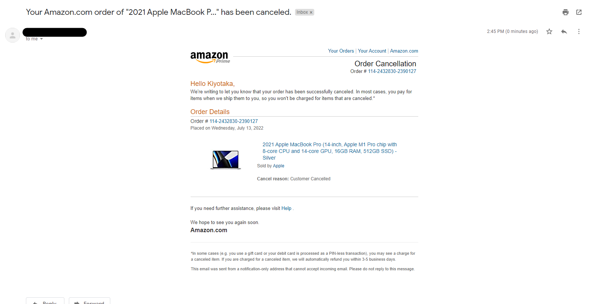

# Phool 

WARNING: The script provided is intended for educational purposes only. Any use of this script for any illegal or unauthorized purpose is strictly prohibited. The creator of this script assumes no liability for any misuse or damage caused by this script. Use at your own risk.

ntroducing a sophisticated phishing tool that enables you to send targeted and convincing phishing emails to your intended victim. The tool comprises two modules that enhance your phishing campaign's effectiveness by leveraging email templates and advanced artificial intelligence.

The first module, Template, features email templates from renowned companies. It creates a realistic phishing email that appears to be originating from a legitimate source, thus increasing the likelihood of the target clicking on the email's embedded links or attachments.

The second module, ChatGPT, utilizes the ChatGPT API's advanced AI algorithms to produce a spear-phishing email tailored to your target. This makes the email even more convincing and enhances the likelihood of achieving your objective.

## Installation

1. Clone the repository or download the script from the repository.
2. Install the required dependencies using the following command:
```
pip install -r requirements.txt

```
 
## Usage

1. Open the terminal/command prompt and navigate to the directory where the script is located.
2. Run the script using the command `python phool.py`.
3. Follow the prompts and enter the required information.
 
Please note that the ChatGPT module requires an OpenAI API key to function. If you don't have one already, you'll need to sign up for the OpenAI API at their website. Once you've signed up, you can access the API key from your dashboard. The key is a unique code that you'll need to enter into the ChatGPT module to enable it to function correctly.

If you do not have access to your own SMTP server, Google's SMTP server is a viable alternative. However, to utilize this server, you will need to generate an app password rather than using your standard password. To learn more about creating an app password for your Google account, please refer to [this link](https://support.google.com/accounts/answer/185833#zippy=%2Cwhy-you-may-need-an-app-password%2Capp-passwords-revoked-after-password-change%2Cforgot-your-app-password).

## Sample Image



